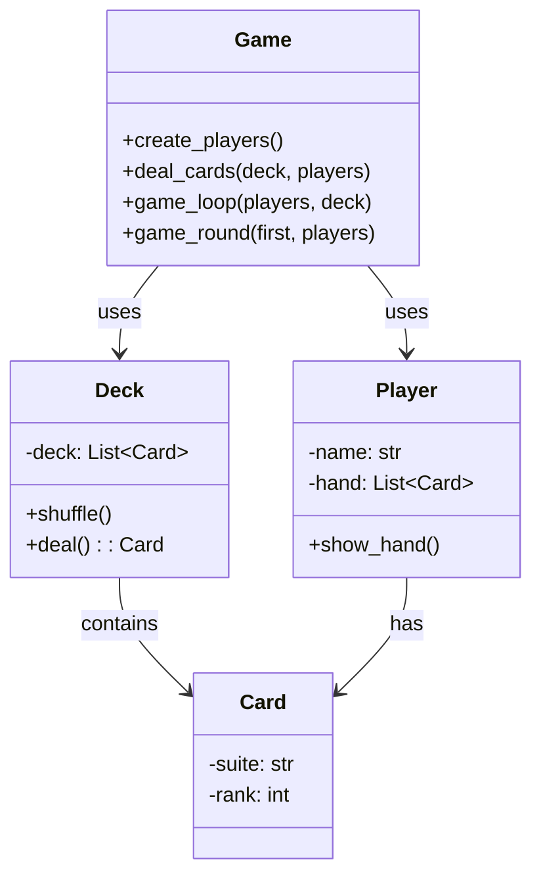

```mermaid
classDiagram
    class Game {
        +create_players()
        +deal_cards(deck, players)
        +game_loop(players, deck)
        +game_round(first, players)
    }

    class Player {
        -name: str
        -hand: List~Card~
        +show_hand()
    }

    class Deck {
        -deck: List~Card~
        +shuffle()
        +deal(): Card
    }

    class Card {
        -suite: str
        -rank: int
    }

    Game --> Player : uses
    Game --> Deck : uses
    Deck --> Card : contains
    Player --> Card : has
```
