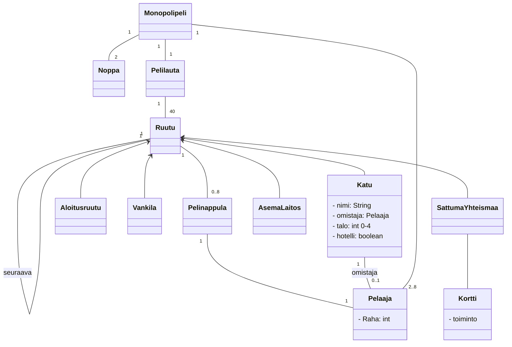

```mermaid
classDiagram
    Monopolipeli "1" -- "2" Noppa
    Monopolipeli "1" -- "1" Pelilauta
    Pelilauta "1" -- "40" Ruutu
    Ruutu "1" -- "1" Ruutu : seuraava
    Ruutu "1" -- "0..8" Pelinappula
    Pelinappula "1" -- "1" Pelaaja
    Pelaaja "2..8" -- "1" Monopolipeli
    Katu "1" -- "0..1" Pelaaja : omistaja

    Ruutu <-- Aloitusruutu
    Ruutu <-- Vankila
    Ruutu <-- SattumaYhteismaa
    Ruutu <-- AsemaLaitos
    Ruutu <-- Katu
    class Katu {
        - nimi: String
        - omistaja: Pelaaja
        - talo: int 0-4
        - hotelli: boolean
    }
    class Kortti {
        - toiminto
    }
    class Pelaaja {
        - Raha: int
    }

    SattumaYhteismaa -- Kortti
```
