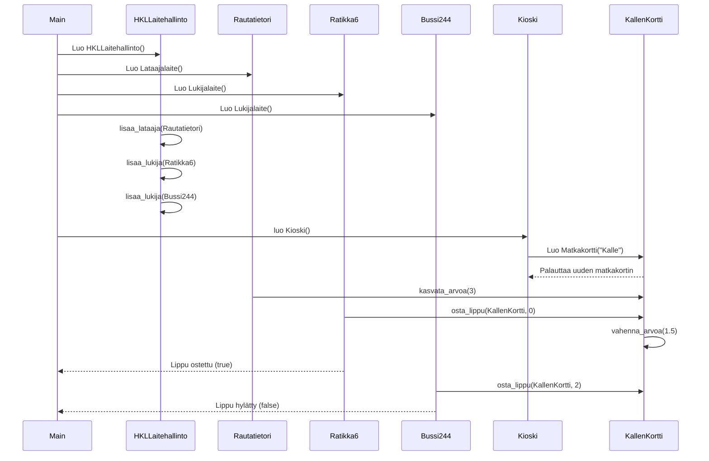

```mermaid
sequenceDiagram

    Main->>HKLLaitehallinto: Luo HKLLaitehallinto()
    Main->>Rautatietori: Luo Lataajalaite()
    Main->>Ratikka6: Luo Lukijalaite()
    Main->>Bussi244: Luo Lukijalaite()

    HKLLaitehallinto->>HKLLaitehallinto: lisaa_lataaja(Rautatietori)
    HKLLaitehallinto->>HKLLaitehallinto: lisaa_lukija(Ratikka6)
    HKLLaitehallinto->>HKLLaitehallinto: lisaa_lukija(Bussi244)

    Main->>Kioski: luo Kioski()

    Kioski->>KallenKortti: Luo Matkakortti("Kalle")
    KallenKortti-->>Kioski: Palauttaa uuden matkakortin

    Rautatietori->>KallenKortti: kasvata_arvoa(3)

    Ratikka6->>KallenKortti: osta_lippu(KallenKortti, 0)

    KallenKortti->>KallenKortti: vahenna_arvoa(1.5)
    Ratikka6-->>Main: Lippu ostettu (true)

    Bussi244->>KallenKortti: osta_lippu(KallenKortti, 2)
    Bussi244-->>Main: Lippu hylätty (false)
```
